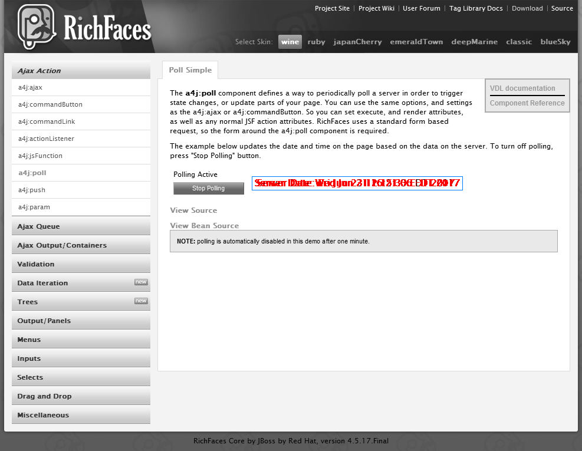

= Ocular

*Ocular* is a simple utility which helps us to add the visual validation feature into the existing *WebDriver* test automation frameworks. *Ocular* uses https://github.com/arquillian/arquillian-rusheye[Arquillian RushEye] for the actual image comparison.
Place below artifact configuration into Maven dependencies just below your `selenium-java` dependency:

[source,xml]
----
<dependency>
    <groupId>com.testautomationguru.ocular</groupId>
    <artifactId>ocular</artifactId>
    <version>1.0.0.Alpha</version>
</dependency>
----

# Terms

* *snapshot* - the baseline image.
* *sample* - the actual image.
* *similarity* - how similar the sample should be while comparing against snapshot.


# Global Configuration:

Ocular expects the user to configure the following properties before doing the visual validation.


|===
|Configuration Property|Description|Type|Default Value

|+snapshotPath+
|location of the baseline images
|Path
|null
|+resultPath+
|location where the results with differences highlighted should be stored 
|Path
|null
|+globalSimilarity+
|% of pixels should match for the visual validation to pass
|int
|100
|+saveSnapshot+
|flag to save the snapshots automatically if they are not present. (useful for the very first time test run)
|boolean
|true
|===

== Configuration code example
Update Ocular global configuration as shown here once – for ex: in your `@BeforeSuite` method.

[source,java,indent=0]
----

Ocular.config()
	.resultPath(Paths.get("."))
	.snapshotPath(Paths.get("."))
	.globalSimilarity(95)
	.saveSnapshot(false);

----
*Note:* Ocular does NOT create these directories. Please ensure that they are present.

== Snapshot in Page Objects

*Page Object* has become the standard design pattern in test automation frameworks as it helps us to encapsulate/hide the complex UI details of the page and makes it easy for the client/tests to interact with the Page.
Ocular makes use of the Page Object structure to keep the baseline images organized.

* Using ```@Snap``` annotation, Page objects / Page abstractions are mapped to the baseline(snapshot) images for the visual validation.
* The baseline images are expected to be available relative to the `snapshotPath`

Example:

Lets assume, *Ocular* configuration is done as shown below.

[source,java,indent=0]
----

Ocular.config()
	.resultPath(Paths.get("c:/ocular/result"))
	.snapshotPath(Paths.get("c:/ocular/snpshot"))
	.globalSimilarity(99)
	.saveSnapshot(true);

----

A Page Object is created for the below page as shown here.

image::src/test/resources/image-compare/RichFacesTheme-blueSky.png[RichFace,400,350]

[source,java,indent=0]
----

@Snap("RichFace.png")
public class RichFace {
    
	private final WebDriver driver;
    
	public RichFace(WebDriver driver){
		this.driver = driver;
	}

}
----

Now *Ocular* looks for the snapshot image at this location - `c:/ocular/snpshot/RichFace.png` - (`snapshotPath + Path given in @Snap`)- in order to do the visual validation.

 *Note: If the image is not present in the location, Ocular creates image and place it under snapshot path. So that Ocular can use this image from the next run onward for comparison.*

[qanda]
What happens if the snapshot image is not present?::
  Ocular creates the screenshot of the current page object and stores in the required path. 
Why do we have this feature?::
  Ocular believes that during the very first run, there might not be any baseline images created. So, it helps the users by saving the snapshots automatically. From the next onwards, snapshots are used as baseline images for compare.
Can I disable this?::  
  Yes, `Ocular.config().saveSnapshot(false)` will stop saving the snapshots if they are not present.
Should the `Snap` annotation be used only for Page Objects?::
  Page Object or Page Fragments.
Is there any other option to use the baseline images without using `@Snap` on the Page Classes?::
  Yes, It is explained later in this doc. Read on!

  
== Comparing Snapshot against Sample

*sample* is the actual image. Sample is created by taking the screenshot of the current page using the *WebDriver*.
  
[source,java,indent=0]
----

@Snap("RichFace.png")
public class RichFace {

	private final WebDriver driver;

	public RichFace(WebDriver driver) {
		this.driver = driver;
	}

	public OcularResult compare() {
		return Ocular.snapshot().from(this) 	// <1>
                     .sample().using(driver)   	// <2>
                     .compare(); 	         	// <3>
    }
}
----

<1> `snpshot.from(this)` - lets *Ocular* read the @Snap value
<2> `sample.using(driver)` - lets *Ocular* to take the current page screenshot
<3> `compare()` - compares the snapshot against sample and returns the result


== Different ways to access Snapshot

[source,java,indent=0]
----
Ocular.snapshot()
	.from(this) 	// or
	.from(RichFace.class) // or
	.from(Paths.get("/path/of/the/image"))
----

== Choosing Right Snapshots at Run Time

Class is a template. Objects are instances. How can we use a hardcoded value for `@Snap` of a Page Class for different instances? 
What if we need to use different baseline images for different instances?
<<<

Valid Question!!

<<<

Lets consider the below RichFace page for example. 

image::src/test/resources/image-compare/RichFacesTheme-blueSky.png[RichFace,400,350]

If you notice, this page has different themes - like `ruby`, `wine`, `classic`, `blue sky` etc. Same content with different themes. So, We can not create different page classes for each theme.
Ocular provides a workaround for this as shown here!

[source,java,indent=0]
----

@Snap("RichFace-#{THEME}.png")
public class RichFace {
    
	private final WebDriver driver;
    
	public RichFace(WebDriver driver){
		this.driver = driver;
	}
	
	public OcularResult compare() {
		return Ocular
			.snapshot()
				.from(this)
				.replaceAttribute("THEME","ruby") // lets the ocular look for RichFace-ruby.png
			.sample()
				.using(driver)
			.compare(); 
	}
}
----


== Excluding Elements

Sometimes, the page object / fragment might contain an element which could contain non-deterministic values. For example, some random number like order conformation number, date/time or 3rd party ads etc. So, We might want to exclude those elements before doing visual validation. 
It can be achieved as shown here.

[source,java,indent=0]
----
Ocular.snapshot()
		.from(this)
	.sample()
		.using(driver)
		.exclude(element)
	.compare();  
----


If we need to exclude a list of elements,

[source,java,indent=0]
----
List<WebElement> elements = getElementsToBeExcluded();
   
Ocular.snapshot()
		.from(this)
	.sample()
		.using(driver)
		.exclude(elements)
	.compare();  	 
----

or 

[source,java,indent=0]
----
Ocular.snapshot()
		.from(this)
	.sample()
		.using(driver)
		.exclude(element1)
		.exclude(element2)
		.exclude(element3)
	.compare();  
----

== Comparing One Specific Element

Ocular can also compare a specific element instead of a whole web page. 

[source,java,indent=0]
----
Ocular.snapshot()
		.from(this)
	.sample()
		.using(driver)
		.element(element)
	.compare();  
----

== Similarity

Sometimes we might not be interested in 100% match. Applications might change a little over time. So we might not want very sensitive compare. In this case, We could use ```similarity``` to define the % of pixels match. For the below example, If 85% of the pixels match, then ```Ocular``` will pass the visual validation. This will override the `Ocular.config().globalSimilarity()` config settings for this page object / fragment.

[source,java,indent=0]
----
@Snap(value="RichFace-#{THEME}.png",similarity=85)
public class RichFace {

}
----

You could also override global `similarity` config value as shown here.

[source,java,indent=0]
----
@Snap("RichFace-#{THEME}.png")
public class RichFace {
    
	private final WebDriver driver;
    
	public RichFace(WebDriver driver){
		this.driver = driver;
	}
	
	public OcularResult compare() {
		return Ocular.snapshot()
			.from(this)
			.replaceAttribute("THEME","ruby") // lets the ocular look for RichFace-ruby.png
		.sample()
			.using(driver)
			.similarity(85)
		.compare(); 
	}
}
----

== Ocular Result

`OcularResult` extends `ComparisonResult` class of `arquillian-rusheye` which has a set of methods & provides result of the visual validation.
The image with differences highlighted is getting saved at `Ocular.config().resultPath()` every time!

[source,java,indent=0]
----
OcularResult result = Ocular.snapshot().from(this)
			 .sample().using(driver)
			 .compare();
			 
result.isEqualImages() // true or false
	  .getSimilairty() // % of pixels match
	  .getDiffImage()  // BufferedImage differences highlighted 
	  .getEqualPixels() // number of pixels matched
	  .getTotalPixels() // total number of pixels

----

== Sample Diff Image  



== Responsive Web Design Testing
Ocular can also be used to test the responsive web design of your application.

To the responsive web design, Lets organize our snapshots in our test framework as shown here.

----
src
    test
        resources
            ocular
                iphone
                    PageA.png
                    PageB.png
                    PageC.png
                ipad
                    PageA.png
                    PageB.png
                    PageC.png
                galaxy-tab
                    PageA.png
                    PageB.png
                    PageC.png                  
                1280x1024
                    PageA.png
                    PageB.png
                    PageC.png   
----

Lets update the Ocular global config with the path where Ocular should expect the snapshots for the visual validation.
[source,java,indent=0]
----
String device = "ipad";
Path path = Paths.get(".", "src/test/resources/ocular/", device);
Ocular.config().snapshotPath(path);
 
 
// now Ocular will use the PageB.png under ipad folder.                
@Snap(value="PageB.png")
public class PageB {
  
}
----

Now as shown above we could easily incorporate the responsive web design validation in our test framework.
